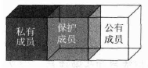
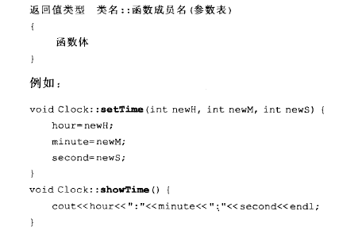

类与对象
===========================
## 基本特点
- 抽象：
- 封装
- 继承
- 多态
## 类和对象
#### 类成员的访问控制：


- public  
- private
- protected

#### 成员函数

- 成员函数的实现：
原型声明要写在类体中，具体实现写在类定义之外。与普通函数不同的是，实现成员函数时指明类的名称。
  
  
- 内联成员函数。
	- 原因：函数调用过程消耗内存资源和运行时间
		- 来传递参数和返回值，
		- 记录调用时的状态，以保证调用完成后正确返回并继续执行。
	- 声明有两种方式
		- 隐式声明： 将函数体直接放在类体内
		- 显示声明：将函数体放在类外。在函数体实现时，在函数返回值类型前加上inline。


## 构造&析构
在定义对象的时候进行的数据成员的设置，称为对象的初始化。在特定对象使用结束后，还需要进行清理工作。分别由构造函数和析构函数进行。
#### 构造函数
在对象被创建时利用特定的值构造对象，将对象初始化为一个特定的状态。在对象被调用是自动调用。构造函数鸣与类名相同，且没有返回值；通常被声明为公有函数。

#### 复制构造函数

形参是本类引用，其作用是使用一个已经存在的对象初始化一个新的同类对象。
赋值运算符（=）作用于一个已存在的对象。构造函数会创建一个新的对象

- 三种情况下被调用

	- 用类的一个对象初始化另一个对象
	- 函数的形参是类对象，调用函数形实结合时
	- 函数的返回值时类对象，函数调用返回时

#### 析构函数

完成对象被删除前的一些清理工作。析构函数是在对象的生存周期即将结束的时刻被自动调用。

与构造函数一样，通常也是类的公有函数成员，名称实在类名前加“~”构成，没有返回值。不接受任何参数，可以为虚函数。


对象的生存周期
=================================

##  标识符的作用域与可见性
#### 作用域
- 函数原型
- 局部作用
- 类作用域
- 命名空间作用域
#### 可见性
  
``` c++
class Solution {
public:
    int minNumberInRotateArray(vector<int> rotateArray) {
        if (rotateArray.size() == 0) return 0;
        int first = 0, last = rotateArray.size() - 1;
        while (first < last) { // 最后剩下一个元素案
            if (rotateArray[first] < rotateArray[last]) { // 提前退出
                return rotateArray[first];
            }
            int mid = first + ((last - first) >> 1);
            if (rotateArray[mid] > rotateArray[last]) { // 情况1
                first = mid + 1;

            }
            else if (rotateArray[mid] < rotateArray[last]) { //情况2
                last = mid;
            }
            else { // 情况3
                --last;
            }
        }
        return rotateArray[first];
    }
};
```